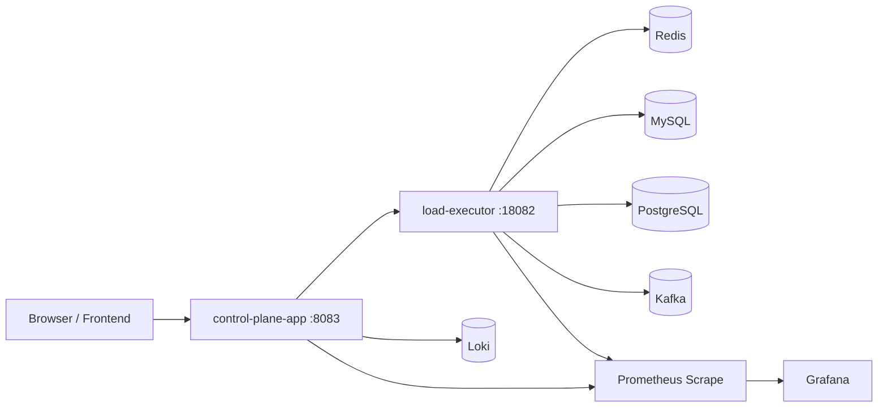
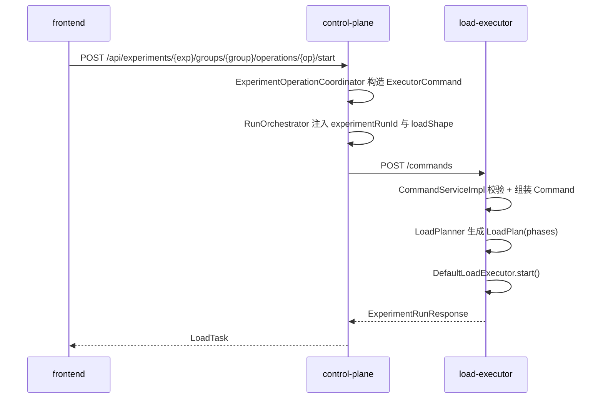

# 架构文档（当前代码快照）

> 更新时间：2026-04-18  
> 目标：帮助你在重新进入项目时，快速理解“系统由什么组成、请求如何流动、从哪里改动最安全”。

## 1. 项目定位

这是一个“实验控制面 + 负载执行器 + 可观测性 + 前端”的压测/实验平台，核心职责是：

1. 在控制面展示可执行实验（experiment/group/operation）。
2. 将启动/停止命令下发到负载执行器。
3. 由执行器按负载形状（qps/concurrency/phase）调度调用具体实验逻辑。
4. 统一输出运行状态与指标，接入 Prometheus/Grafana/Loki。

## 2. 当前活跃模块

以当前目录结构为准，真正在用的主要模块：

- `control-plane-app`：控制面后端（端口 `8083`）
- `load-executor`：负载执行器后端（端口 `18082`）
- `frontend`：Vite + React 前端（开发端口 `5173`，`/api` 代理到 `8083`）
- `docker-compose.yml`：本地基础设施（Redis/MySQL/Kafka/Flink/Prometheus/Grafana/Loki 等）
- `k8s/`：k3s 基线骨架，采用 `base + overlays/k3s` 组织 namespace 和应用部署

注意：根 `pom.xml` 仍声明了 `experiment-core`、`load-executor-app` 模块，但这两个目录在当前工作区不存在，属于历史结构残留。

## 3. 系统分层

## 4. 核心调用链

### 4.1 实验启动链路

### 4.2 运行中调度链路（执行器内部）

1. `DefaultLoadExecutor` 为每个 `experimentRunId` 创建 `RunContext`。
2. 调度线程按 `tickMillis`（默认 100ms）推进。
3. 基于当前 `LoadPhase.targetQps` 计算本 tick 要派发的请求数。
4. 通过 worker 线程池并发执行 `ExperimentInvoker.invoke(handle, context)`。
5. 更新内存运行仓库与 Micrometer 指标（QPS、成功/失败、延迟）。

## 5. 两个后端的职责边界

### 5.1 control-plane-app（编排层）

主要职责：

- 提供前端 API：
  - `/api/experiments`（实验目录、启动/停止、状态）
  - `/api/config`（前端配置枚举）
  - `/api/observability/*`（Grafana 嵌入链接）
  - `/api/logs`（Loki 日志聚合查询）
- 通过 `RemoteLoadExecutorClient` 调用执行器 API（`/commands`、`/runs`、`/experiments`）。
- 将 UI 层的任务概念（`taskId=exp:group:op`）映射为 `experimentRunId` 生命周期。

### 5.2 load-executor（执行层）

主要职责：

- 接收命令：`/commands`（start/stop/pause/resume）
- 查询运行：`/runs`、`/runs/{id}`
- 暴露实验元数据：`/experiments`
- 维护实验注册表：`DefaultExperimentRegistry`
- 将负载形状转为阶段计划：`DefaultLoadPlanner`
- 执行并发调度与指标采集：`DefaultLoadExecutor`

## 6. 实验扩展机制（最关键）

实验通过 `ExperimentGroup` 插件式扩展。每个 Group 提供：

1. `experimentId/groupId` 元数据。
2. `operations()` 列表（操作 ID、参数、默认负载模板、invoker）。
3. 每个 operation 的实际业务执行函数（invoker）。

当前可见实验组包含：

- `favorite`：收藏读写/预热
- `wallet_query`：钱包快照查询、预热、重建、事件发布
- `kafka_kline`：K 线消息写入 Kafka
- `udqs_plan`、`metadata_cache`：ConcurrentMap 类缓存实验
- `onchain_mock`：链上 mock 数据生成与写入

新增实验的推荐路径：

1. 新建一个 `ExperimentGroup` 实现类。
2. 在 `operations()` 声明操作参数与默认负载模板。
3. 将操作逻辑放在独立 service，invoker 只做参数组装。
4. 启动后由 Spring 自动注入，`DefaultExperimentRegistry` 自动注册。

## 7. 数据与依赖

执行器依赖多数据源：

- Redis：缓存/标签等
- MySQL：部分实验数据
- PostgreSQL：`wallet` 等实验 JDBC 源
- Kafka：行情/链上/钱包事件
- Nacos（可选）：动态实验参数覆盖（`experiment.dynamic-config.enabled=true` 时）

可观测性：

- 两个后端均暴露 Actuator + Prometheus 指标
- Grafana 从 Prometheus/Loki 展示图表
- control-plane 可生成带变量的 Grafana embed URL 给前端 iframe

## 8. 前端角色

前端是“控制台”而非核心执行引擎，主要做三件事：

1. 拉取实验目录，渲染操作卡片。
2. 发起 start/stop，轮询运行状态。
3. 展示 Grafana 面板与 Loki 日志。

技术栈：React 18 + Vite，`/api` 统一代理到 `http://localhost:8083`。

## 9. 运行入口

常用本地启动方式：

1. `docker-compose up -d` 启基础设施
2. `./run-load-executor.sh` 启执行器
3. `./run-control-plane.sh` 启控制面
4. `cd frontend && npm run dev` 启前端

说明：仓库里的 `QUICKSTART.md` 提到 `start.sh/verify.sh` 与单体 `8080` 入口，和当前双后端结构不一致，建议按上述方式运行。

## 9.1 k3s 运行入口

如果要切到 k3s 基线，建议按下面顺序：

1. 安装 `k3s`、`helm` 和 `Longhorn`，确保集群有可用 StorageClass。
2. `kubectl apply -k k8s/base/namespaces` 建立平台边界。
3. `kubectl apply -k k8s/overlays/k3s` 注入控制面和执行器运行参数。
4. 用 `K3S_DEPLOYMENT_GUIDE.md` 安装 Redis Cluster 样板，先跑 `favorite/read_cache_aside` 的 baseline。
5. 用 `K3S_VERIFICATION_TEMPLATE.md` 记录压测和故障注入结果。

## 10. 读代码建议顺序（回归最快）

1. `control-plane-app/.../controller/ExperimentController`
2. `control-plane-app/.../controlplane/ExperimentOperationCoordinator`
3. `control-plane-app/.../controlplane/RunOrchestrator`
4. `load-executor/.../service/CommandServiceImpl`
5. `load-executor/.../planner/DefaultLoadPlanner`
6. `load-executor/.../executor/DefaultLoadExecutor`
7. 任一 `load-executor/.../experiment/*ExperimentGroup`

按这个顺序看，能最快建立“外部请求 -> 计划 -> 调度 -> 业务 invoker”的完整心智模型。
