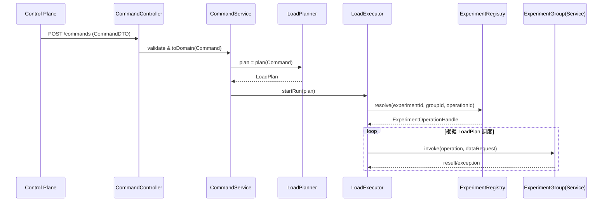

**把“负载执行器”当成一个小型压测框架**来设计——上游只有一个 `/commands` 接口，下游只知道「有一个 experiment + operation 要被以某种负载形状调用」。核心是 3 件事：

1. **统一命令模型**：把控制面发来的 JSON 变成领域对象 `Command` / `LoadShape` / `ExperimentRun`。
2. **可调度的负载计划**：`LoadPlanner` 把「qps + concurrency + 热点配置」转成一组可调度的 `LoadPlan`（时间片 + 调度策略）。
3. **可控执行引擎**：`LoadExecutor` 维护每个 `experimentRunId` 的 worker 池和调度循环，负责起停、动态调整，并通过 `ExperimentInvoker` 调用具体 experiment 的 `operation`。

下面按金字塔结构展开。

## 一、总体架构 & 数据流

### 1.1 核心流转（从 /commands 到实验代码）



### 1.2 核心领域对象（建议）

- `Command`：控制面发来的一次“起负载”请求
    - `experimentId`, `groupId`, `operationId`
    - `experimentRunId`
    - `operationType`（ONCE / CONTINUOUS_READ / WRITE / MIXED...）
    - `dataRequest`（JsonNode / Map）
    - `loadShape`（见下）
- `LoadShape`
    - `type`：`constant`, `ramp`, `burst`, `hot_key`, `custom_script` ...
    - `qps`, `concurrency`
    - `duration`（可选，持续时间；不填由控制面负责 stop）
    - `params`：热点 key 配比、键空间大小、突发间隔等
- `LoadPlan`
    - 一组**时间片段**和**调度参数**
    - 如：`List<Phase>`，每个 `Phase` 包含 `startOffset`, `endOffset`, `targetQps`, `concurrency`, `hotKeyConfig`
- `ExperimentRun`
    - `experimentRunId`
    - `status`：INIT / RUNNING / PAUSED / STOPPED / FAILED
    - `command` / `loadShape` / `startTime` / `endTime`
- `LoadTask`
    - 一次对 experiment 的 `operation` 调用，带 traceId、请求参数等

---

## 二、负载转化模块设计

### 2.1 CommandController

职责：**只做输入边界适配和安全校验**。

- REST：`POST /commands`
- 工作：
    1. JSON → `CommandDTO`
    2. 基础校验：必填字段、类型、范围（qps > 0，concurrency > 0 等）
    3. 调用 `CommandService.submitCommand(CommandDTO)`
    4. 返回：`experimentRunId` + 当前 `status=INIT` 或 `RUNNING`

> 注意：/commands 不负责停机，建议另有 /commands/{experimentRunId}/stop、/commands/{experimentRunId}/pause 等接口，对接 LoadExecutor。
> 

### 2.2 CommandService（应用层协调者）

职责：**把一次 Command 变成可执行的 Run**。

关键方法示意：

```java
public interface CommandService {
    ExperimentRunId submitCommand(CommandDTO dto);
    void stopRun(String experimentRunId);
    void pauseRun(String experimentRunId);
    void resumeRun(String experimentRunId);
}

```

处理流程：

1. `CommandDTO -> Command`（domain）
2. 校验 experiment 是否存在（通过 `ExperimentRegistry`）
3. 调用 `LoadPlanner.plan(Command)` 得到 `LoadPlan`
4. 构建 `ExperimentRun` 并持久化（可选：存数据库 or 内存 map + WAL）
5. 调用 `LoadExecutor.start(ExperimentRun, LoadPlan)`
6. 记录审计 / 日志（方便回溯这次试验）

---

## 三、LoadPlanner：从 “想要的负载” 到 “可调度计划”

### 3.1 设计目标

- 将控制面上看得懂的配置（qps / concurrency / 热点类型）**转成一个时间轴上的计划**。
- 负载形状可扩展，而 LoadExecutor 尽量只认通用概念：**目标 tps / 并发 / 热点分布**。

### 3.2 LoadShape → LoadPlan 的常见规则

以你例子中的 `hot_key` 为例：

```json
"loadShape": {
  "type": "hot_key",
  "params": {
    "hotKeyRatio": 0.8,
    "hotKeyCount": 10,
    "keySpaceSize": 10000
  },
  "qps": 5000,
  "concurrency": 100,
  "durationSeconds": 600
}

```

`LoadPlanner` 可以这样转：

- `durationSeconds = 600`，拆为一个 Phase：
    - `Phase #0`:
        - `startOffset=0`, `endOffset=600`
        - `targetQps=5000`, `concurrency=100`
        - `hotKeyConfig={80% 请求落在前 10 个 key, 20% 均匀分布在 1..10000}`

如果是 `ramp`：

```json
"type": "ramp",
"params": { "fromQps": 1000, "toQps": 10000, "stepSeconds": 60 }

```

则拆成多个 Phase，每 60 秒 qps 抬一档。

### 3.3 LoadPlanner 接口示例

```java
public interface LoadPlanner {
    LoadPlan plan(Command command);
}

```

LoadPlan 结构示意：

```java
class LoadPlan {
    String experimentRunId;
    List<Phase> phases;
}

class Phase {
    Duration startOffset;
    Duration endOffset;
    int targetQps;
    int maxConcurrency;
    HotKeyConfig hotKeyConfig; // 可为 null
}

```

---

## 四、LoadExecutor：执行引擎 & 生命周期管理

### 4.1 设计目标

1. **每个 experimentRunId 对应一个 “执行上下文”**，可起停。
2. 能满足：
    - qps 限流（节流模式，如令牌桶）
    - 并发控制（线程池 / 协程数）
    - 热点调度（根据 LoadPlan 中的分布选择数据请求）
3. 对 Grafana 友好：所有 metrics 都带 `experimentRunId` 等 label。

### 4.2 组件拆分

- `LoadExecutor`：对外 API
- `RunContext`：一次实验运行的内部状态
    - `ExperimentRun` + `LoadPlan`
    - `ExecutorService`（线程池）
    - `Scheduler`（调度线程 / 定时任务）
    - `RateLimiter` / `TokenBucket`
    - 状态机（RUNNING/PAUSED/STOPPED）

接口示意：

```java
public interface LoadExecutor {

    void start(ExperimentRun run, LoadPlan plan);

    void stop(String experimentRunId);

    void pause(String experimentRunId);

    void resume(String experimentRunId);

    Optional<RunStatus> getStatus(String experimentRunId);
}

```

### 4.3 调度逻辑（简化）

1. `start()` 时：
    - 建立 `RunContext`，放入 `ConcurrentHashMap<experimentRunId, RunContext>`
    - 启动一个调度线程（或使用 `ScheduledExecutorService`）：
        - 每 100ms tick：
            1. 计算当前所处 `Phase`
            2. 根据 `targetQps` 转成“本 tick 应发起多少个请求”
            3. 调用 `executor.submit(() -> invokeOnce(...))`，受 `maxConcurrency` 保护
2. `invokeOnce()`：
    - 通过 `ExperimentInvoker` 找到 operation handle
    - 生成一次 `LoadTask`：
        - 填充 `dataRequest`（包含根据热点算法生成的 key 等）
    - 调用业务代码：
        - `experiment.invoke(operationId, request)`
    - 捕获异常，记录 metrics（成功/失败/延时/异常类型）
3. `stop()`：
    - 将状态设为 STOPPED
    - 关闭调度器 + 线程池（优雅停机）

> 实现上可以根据技术栈选择：Java 可用 ScheduledThreadPoolExecutor + Semaphore，或 Reactor/Vert.x 实现异步。
> 

### 4.4 operationType 的处理

- `ONCE`：
    - 只执行一次 `invokeOnce`；`LoadExecutor` 无需建立复杂的 `LoadPlan`，可直接同步执行（或异步但无循环）。
- `CONTINUOUS_READ` / `CONTINUOUS_WRITE`：
    - 走完整负载执行流程；当 `duration` 缺省，则由控制面调用 `/stop` 结束。
- 将 `operationType` 转成执行策略：
    - 影响：
        - 是否允许写入（可在 experiment 层控制）
        - 是否需要 warmup phase
        - 是否需要力度更大的错误回退（如写类操作失败过多要自动 stop）

---

## 五、experiment 模块：迷你微服务抽象

### 5.1 抽象接口

目标：**每个实验组就是一个实现了统一接口的 service**。

```java
public interface ExperimentGroup {

    String getExperimentId();   // e.g. "userFavoriteTokenSet"
    String getGroupId();        // 可选

    Enum<?>[] supportedOperations();

    Object invoke(Enum<?> operationId, OperationType opType, Object dataRequest);
}

```

> 或者更类型安全：Map<OperationId, ExperimentOperationHandler>。
> 

### 5.2 ExperimentRegistry & ExperimentInvoker

- `ExperimentRegistry`
    - 启动时扫描所有 `@Experiment` bean
    - 建立映射 `(experimentId, groupId) -> ExperimentGroup`
- `ExperimentInvoker`
    - 提供统一入口给 `LoadExecutor` 调用：

```java
public interface ExperimentInvoker {
    Object invoke(String experimentId,
                  String groupId,
                  String operationId,
                  OperationType opType,
                  Object dataRequest);
}

```

内部流程：

1. 查找 ExperimentGroup
2. 将 `operationId` 转成枚举
3. 将 `dataRequest` 反序列化成对应 DTO（experiment 自己负责）
4. 调用对应方法
5. 返回结果 / 抛出异常

### 5.3 对控制面的只读接口

experiment 模块再提供一套只读的 metadata：

- `/experiments`：实验列表
- `/experiments/{id}`：实验详情
    - 实验介绍、能调哪些 operation、所需参数 schema、推荐负载形状等

这些都是 **静态/配置化** 信息，控制面不做增删改。

## 六、datasource 模块：从组件到实验的“连接层”

你给的定位很好：**datasource 只提供通用访问能力；业务一律在 experiment/repository 内部实现。**

建议抽象：

```java
public interface RedisDataSource {
    <T> T execute(Function<Jedis, T> callback);
}

public interface MySqlDataSource {
    <T> T execute(Function<DataSource, T> callback);
}

```

特点：

- 封装连接池、序列化、错误转换（比如 Redis 超时 -> 自定义异常）
- 提供统一 metrics（connect pool size、RT、error rate）
- experiment 的 repository 只管自己的 key 设计和读写逻辑，例如：

```java
class UserFavoriteTokenRepository {

    private final RedisDataSource redis;

    public List<String> getFavoriteTokens(long userId) {
        return redis.execute(jedis -> jedis.lrange("fav:"+userId, 0, -1));
    }
}

```

---

## 七、可观测性：为 Grafana 指标预留结构

无论是负载执行器还是 experiment，都应该统一打点，核心标签：

- `experimentId`
- `experimentRunId`
- `groupId`
- `operationId`
- `operationType`
- `component`（redis / mysql / jvm / kafka / executor）

建议指标：

1. **LoadExecutor 侧**
    - `load_requests_total{...}` 成功/失败数（带 outcome label）
    - `load_request_latency_seconds_bucket{...}`
    - `load_qps{...}`（可由 Prometheus rate 计算）
2. **datasource 侧**
    - `redis_cmd_latency_seconds_bucket{cmd="GET"/"SET"/...}`
    - `mysql_query_latency_seconds_bucket{sqlTag="getFavorite"}`

有了这些，再配合 `experimentRunId` 过滤，你的 Grafana 就能**按一次实验的维度**观察所有组件行为。

### 7.1 Kafka 可观测镜像（基于 confluentinc/cp-kafka:7.4.1）

已经在 `docker-compose.yml` 里加了一套完整的 Kafka 可观测体系，专门给需要观测 broker/请求/消费组延迟的业务高阶开发者使用：

- **自定义镜像**：`kafka/Dockerfile` 继承 `confluentinc/cp-kafka:7.4.1`，默认启用 KRaft 单节点模式，并用 `jmx_prometheus_javaagent` 暴露 HTTP `/metrics`（`7071` 端口）。
- **Kafka Exporter**：`quay.io/danielqsj/kafka-exporter` 从 broker 拉取 topic / consumer group 延迟指标（`9308` 端口）。
- **Kafka UI**：`provectuslabs/kafka-ui` 自带 Topic/Consumer 可视化，并自动挂上 `http://kafka:7071/metrics`。
- **Prometheus/Grafana 集成**：`prometheus/prometheus.yml` 新增 `kafka-jmx`、`kafka-exporter` job，Grafana 默认加载 `grafana/provisioning/dashboards/kafka-observability-dashboard.json`。

#### 启动与验证

```bash
# 构建带 JMX agent 的 cp-kafka 镜像
docker compose build kafka

# 启动 Kafka + Exporter + Kafka UI（可和其他服务一起启动）
docker compose up -d kafka kafka-exporter kafka-ui
```

- Kafka 客户端：`PLAINTEXT://localhost:9092`
- Prometheus 采集端点：`kafka:7071`（broker JMX），`kafka-exporter:9308`（consumer lag）
- Grafana Dashboard：`Kafka Observability`（自动出现在 `http://localhost:3000` 中）
- Kafka UI：`http://localhost:8085`，用于管理 Topic / Consumer 与实时指标

如果要自定义指标，可修改 `kafka/jmx/kafka-broker.yml` 后重新 `docker compose build kafka`。

### 7.2 Flink 可观测体系（基于 flink:1.20-scala_2.12-java17）

- **组件布局**：
  - `flink-jobmanager` / `flink-taskmanager`：使用 upstream 镜像，挂载 `flink/conf/flink-conf.yaml`，开启 `PrometheusReporterFactory`。分别将 `metrics.reporter.prom.port` 固定到 `9250/9251`，方便 `prometheus`/`Grafana` 抓取。
  - `prometheus/prometheus.yml` 增加 `flink-jobmanager`、`flink-taskmanager` job，`grafana/provisioning/dashboards/flink-observability-dashboard.json` 提供吞吐 / checkpoint / CPU / slot 健康视图。
- **启动方式**：

```bash
# 拉起 Flink 及其 TaskManager
docker compose up -d flink-jobmanager flink-taskmanager
```

- Flink Web UI：`http://localhost:8081`
- Prometheus scrape：`flink-jobmanager:9250`、`flink-taskmanager:9251`
- Grafana Dashboard：`Flink Observability`

#### Prometheus vs 机器级监控的取舍

| 关注点 | 适合进 Prometheus（Flink Reporter） | 更适合直连机器/宿主监控 |
| --- | --- | --- |
| **作业层指标** | `numRecordsIn/Out`, `checkpoint duration/size`, `busyTimeMsPerSecond`, `backPressure`, `TaskManager CPU load`, `task slot usage` —— 需要按 job/operator 维度打 label，适合在 Prometheus / Grafana 中关联 `experimentRunId`、job 名称。 | - |
| **Flink JVM 行为** | `Status.JVM_CPU_Load`, `Status.JVM_Memory_*`, GC 时间等已经暴露在 reporter 里，可直接抓取，便于同 dashboard 中对比 job 指标。 | 若需要更细粒度（对象分代、thread dump），可直接进容器或拉 `jfr`。 |
| **宿主资源 / 网络** | - | CPU steal、宿主磁盘 IO、网络丢包、cgroup throttle、宿主级磁盘容量，这些由 node_exporter / cAdvisor / CloudWatch 更准确，避免把 infrastructure 噪声混入 job label。 |
| **日志 / 事件** | 通过 Loki/Promtail（已有）或直接读容器 log，配合 Flink Web UI 查看异常。 | - |

> 简单总结：**作业拓扑 / 状态 / JVM 指标走 Prometheus，硬件层面仍交给宿主监控**。这样 Grafana 面板聚焦业务语义（job 名、operator、checkpoint），底层资源瓶颈则在节点观察面定位。


## 接口
curl -X GET http://localhost:18082/experiments
http://{load-executor-host}:18082/commands
{
  "experimentId": "favorite",
  "groupId": "default",
  "operationId": "read_cache_aside",
  "loadShape": {
    "type": "hot_key",
    "qps": 2000,
    "concurrency": 64,
    "durationSeconds": 60,
    "params": {
      "hotKeyRatio": 0.8,
      "hotKeyCount": 50,
      "keySpaceSize": 1000
    }
  },
  "dataRequest": {
    "startUserId": 100000,
    "userCount": 5000,
    "symbols": ["BTCUSDT", "ETHUSDT", "SOLUSDT"],
    "tags": "scene1"
  }
}
